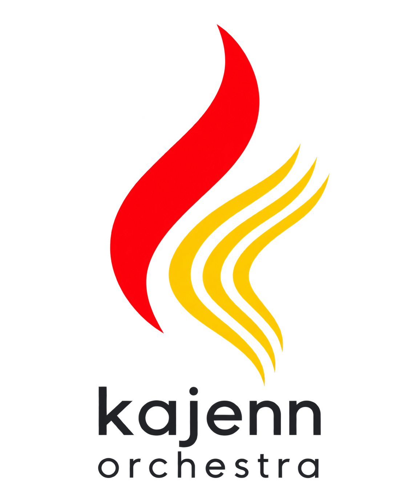

# kajenn-orchestra — visual identity

Version 0.1 · Last updated: 2026-09-18 · Status: selected logo assets; shared interface theme remains proposed.

## Logos

### Without lettering

[kajenn-orchestra-mark.png](kajenn-orchestra-mark.png) is a 1254 × 1254 transparent PNG. One red curve coordinates three slender, parallel gold curves. This is the selected variant; the earlier mosaic concepts are not the product identity.

### With lettering

[kajenn-orchestra-logo.png](kajenn-orchestra-logo.png) is a 1145 × 1374 transparent PNG. The lowercase kajenn line appears above orchestra. The second line uses smaller, spaced lettering to match the first line's visible width. Use the complete logo on light backgrounds.

## Shared visual system

**Everything else follows kajenn.** Colors, interface typography, spacing, density, icon style, controls, accessibility targets, tables, charts, logs and terminal presentation inherit the [kajenn visual identity and theme guide](https://github.com/kajenn-org/kajenn/blob/main/assets/branding/theme-guide.md).

Related shared files:

- [Visual reference sheet](https://github.com/kajenn-org/kajenn/blob/main/assets/branding/theme-reference.html)
- [Theme tokens](https://github.com/kajenn-org/kajenn/blob/main/assets/branding/theme-tokens.json)
- [Contrast checks](https://github.com/kajenn-org/kajenn/blob/main/assets/branding/contrast-check.json)

These links point to the shared assets in the kajenn repository. Do not copy the common rules here: changes belong in the shared source.

The Orchestra distinction is the three gold curves and the second wordmark line. It does not introduce a separate UI font, palette or semantic state system.

## Usage and limitations

- Preserve colors, aspect ratio, orientation and transparent margins.
- Prefer a symbol box of 48 px or larger so the three gold curves remain distinguishable. At 16–24 px they tend to merge; a dedicated favicon is not included.
- On a dark surface use the standalone mark with a separate light product label, not the dark raster wordmark.
- These are raster assets. A vector master, monochrome export and common lettering master are not included.
- The visible kajenn lettering measures approximately 611 × 166 px here and 615 × 168 px in the matching kajenn-only raster on the same 1145 × 1374 canvas. The match is visual, not pixel-identical; the lettering does not identify a reusable font.

## Applying the shared theme to orchestration

Keep navigation contextual: load overview → worker → details → registries, logs or terminal for the same target. Use shared states for healthy, warning, error, running and unreachable. A missing metric is not zero; show units and observation time. When configuration changes affect multiple workers, display individual results and partial outcomes. No additional decorative colors are assigned to workers merely to distinguish them.
