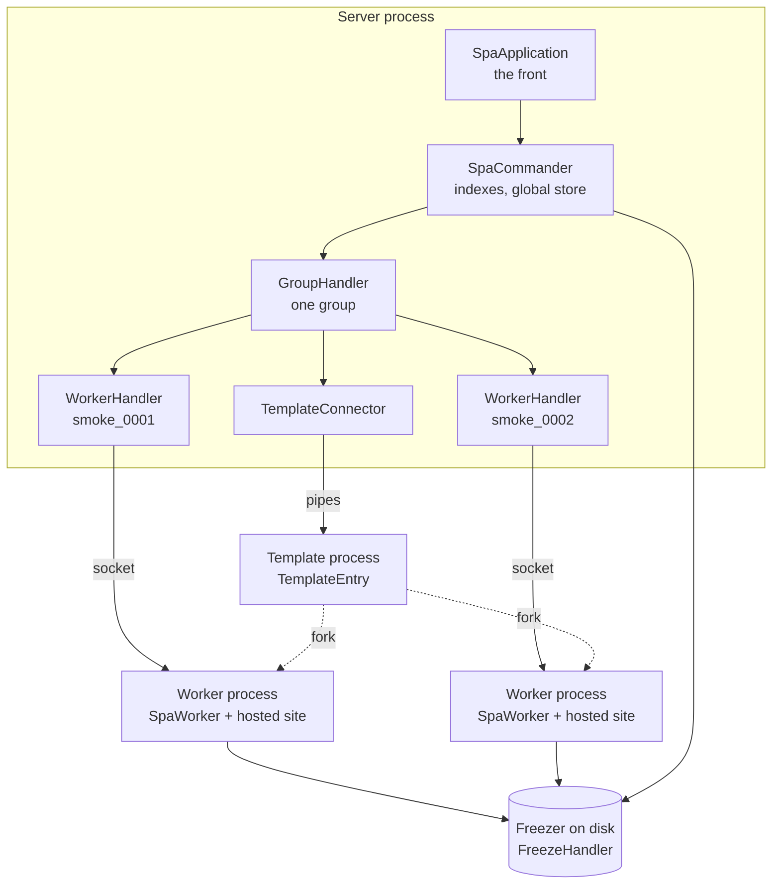
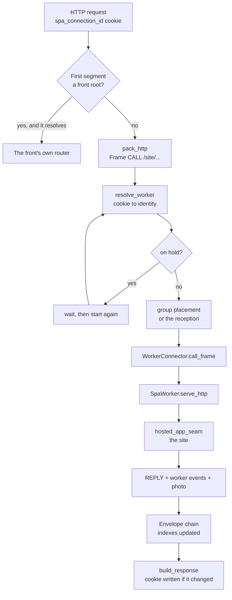
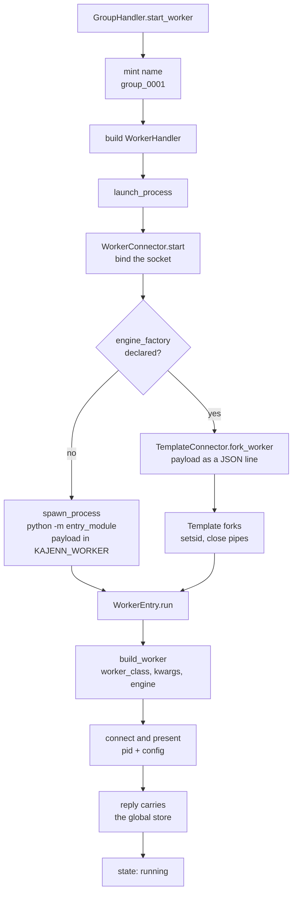
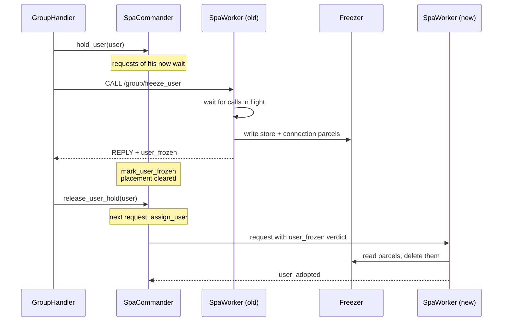
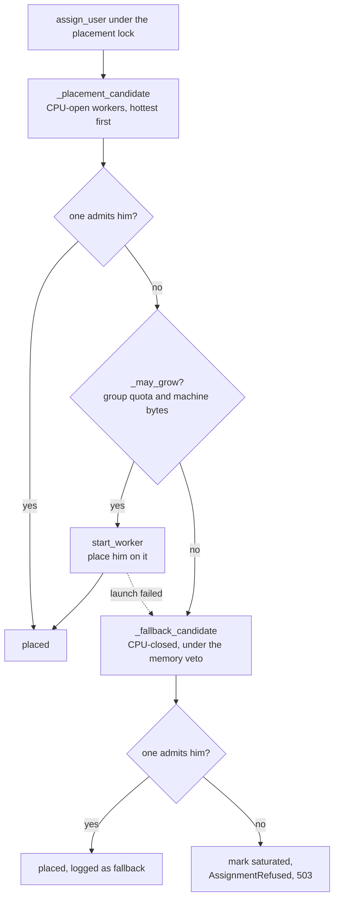
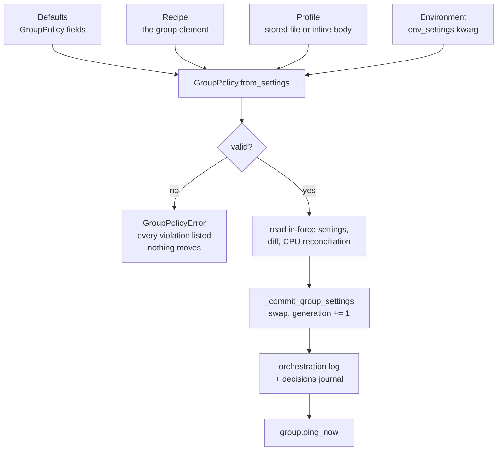

# Architecture overview

Six pictures of the same machine: where the processes are, how a request reaches
one of them, how one is born, how a user moves between two of them, how a group
decides whom to admit, and how a new configuration takes effect.

Each diagram is followed by the classes that do the work, named with their
module. Everything lives in `kajenn_orchestra` unless the text says otherwise.

(a-process-topology)=
## The process topology

One server process holds the front and the commander. Every worker is a process
of its own, reached over a Unix socket. A group that declares an engine factory
holds one more process, the template, which exists only to fork workers.

`SpaApplication` (`spa_app.py`) is mounted by the recipe and builds its
`SpaCommander` (`orchestration/spa_commander.py`) at startup, out of the
`orchestration.commander` node written under its own application code. The
commander builds one `GroupHandler` (`orchestration/group_handler.py`) per entry
of `groups`, and each group builds a `WorkerHandler`
(`orchestration/worker_handler.py`) per worker it launches. A handler owns a
`WorkerConnector` (`orchestration/worker_connector.py`), which binds
`<instance_dir>/<name>.sock` and accepts exactly one child on it. The child runs
`WorkerEntry` (`orchestration/worker_entry.py`) and builds the `SpaWorker`
subclass the group named. `TemplateConnector`
(`orchestration/template_connector.py`) and `TemplateEntry`
(`orchestration/template_entry.py`) appear only when the group declared
`engine_factory`. The freezer is one directory tree under
`frozen_users_path`, reached only through `FreezeHandler`
(`orchestration/freeze_handler.py`).

(b-the-life-of-a-request)=
## The life of a request

The front does no routing of its own for a site path: it packs the request whole
and the commander walks it to a worker.

`SpaApplication.__call__` reads the first path segment against
`internal_roots` and, for anything else, calls `forward_request`, which packs an
`HttpRecord` into a `Frame` and hands it to `SpaCommander.serve_request`. That
method calls `resolve_worker`, which turns the cookie into an identity through
`connection_user_map`, raises and waits out `UserOnHold`
(`orchestration/exceptions.py`) while the user is between two homes, and either
returns his placed worker, asks `GroupHandler.assign_user` for one, or — for a
guest — returns the group's reception. The frame travels on
`WorkerConnector.call_frame`; inside the child `SpaWorker.answer_call` routes the
`http` form to `serve_http`, which resolves the user's row and calls
`hosted_app_seam`. The reply carries three things beside the response bytes: the
worker events of everything that changed on the registers, the worker's photo,
and any writes the site made to the global store. All three are folded by the
chain in `orchestration/envelope_handler.py` before the caller is unblocked,
which is why `SpaApplication.build_response` can trust `connection_id` in the
reply info when it decides whether to write the cookie.

`AssignmentRefused` becomes a 503 with `Retry-After`, `SiteFailedRequest` a 502,
and a dead wire a 502 while the server is running or a 503 while it is leaving.

:::{admonition} Under review
:class: warning
`internals/20_spa/010_spa-application/design.md` translates a dead wire to 502
without qualification. The code answers 503 with `Retry-After` when the server
has left `RUNNING`, because that wire was killed on purpose
(`SpaApplication.wire_lost_response`).
:::

(c-the-birth-of-a-worker)=
## The birth of a worker

A worker is born in one of two ways. The difference is who its parent is, and
whether the group engine is built again.

`GroupHandler.start_worker` mints `<group>_<counter>` and builds the
`WorkerHandler`; `launch_process` binds the socket first, then calls
`start_process`, which picks the birth. Without a template,
`spawn_process` runs `subprocess.Popen([executable, "-m", entry_module])` with
`spawn_payload` JSON-encoded in the `KAJENN_WORKER` environment variable and
`start_new_session=True`; the result is a `SpawnedProcess`
(`orchestration/worker_process.py`), whose parent is the handler. With a
template, `TemplateConnector.fork_worker` writes the same payload as one JSON
line on the template's stdin and reads back a pid; the result is a
`ForkedProcess`, whose parent is the template. The template itself is launched
lazily, on the first fork request that finds none alive, and its first answer
costs the whole engine build.

`launch_process` then awaits `WorkerConnector.wait_connected` bounded by
`process_ping_timeout`; a child that never presents itself is killed and the
launch raises. The presentation is the one envelope whose descent carries
anything: the global store, whole, because a newborn is the only process holding
none of it. Only after that is the handler `running`.

(d-mobility)=
## Freeze and reassignment

The one path a user takes from one process to another. Nothing is transferred
between processes: the state goes to disk and comes back.

`GroupHandler.freeze_hosted_user` raises the barrier at the vertex first —
`SpaCommander.hold_user` writes `on_hold` on the row and creates the event a
waiting request parks on — and only then orders the worker. Inside the child,
`GroupOrders.freeze_user` calls `SpaWorker.freeze_designated_user`, which waits
for whatever holds the user (an adoption in flight, his own calls) and then
`freeze_user` writes the parcels under the folder lock and announces
`user_frozen`. That worker event rides the same reply, and the envelope chain
reads it before the caller is answered:
`WorkerEnvelopeHandler.on_user_frozen` drops him from the handler's
`hosted_users`, `GroupEnvelopeHandler.on_user_frozen` sets his entry in
`user_worker_map` to `None`, and `CommanderEnvelopeHandler.on_user_frozen` marks
the row frozen. `freeze_hosted_user` releases the hold; a departure that did not
happen releases it too, and the refusal is written to the orchestration log.

The wake is the ordinary request path. `resolve_worker` finds no placement and
calls `assign_user`, and the frame carries the `user_frozen` verdict the
commander attached. `SpaWorker.adopt_user` reads the parcel, deletes it — and
the folder with it when it was the last thing inside — and announces
`user_adopted`, which turns the mark off. A burst of requests on a frozen user
reads the disk once: the first marks the row `unfreezing` and the others await
that transition.

Three things order a freeze: `check_user_activity`, when a user has been silent
past `user_idle_freeze_minutes`; `check_cpu_offload`, when a CPU-hot worker must
slim; and `quit`, which cedes everybody. A user never changes group.

(e-admission)=
## The admission decision of a group

A placement is a walk, and a worker refuses by raising. Three levels, each tried
only when the one before gave up.

`GroupHandler.assign_user` runs under `_placement_lock`, so sixteen simultaneous
arrivals father one worker and not sixteen. `WorkerHandler.assign_user` is the
judgment: it reads its own last photo against its group's setpoints and raises
`NoRoomError` when it already holds `worker_max_users` placed users or stands
past `worker_memory_admission_percent`, and `WorkerQuittingError` when its
process is leaving. Workers are walked fullest-first, so warm memory is filled
before cold memory is opened. `_may_grow` holds two gates: the group's own
`memory_max_percent` against what its living workers already hold, and the bytes
`SpaCommander.memory_available_bytes` says the machine still has free, read from
the cgroup where there is one. The CPU-closed fallback exists so that the soft
CPU policy never costs a 503 the hard memory limit would not have cost; it is
logged as a decision every time.

A guest never leaves his group's reception — the oldest living worker — whatever
the walk would say. Only a login makes a browser placeable.

(f-applying-a-profile)=
## Applying a configuration profile

The effective setpoints of a group are a composition of four levels, recomposed
at every apply.

`SpaApplication.boot_group_settings` composes the four levels at startup, so the
pool is born already effective; a named profile that is missing or invalid makes
the boot raise `FatalBootError` and the server does not start. At runtime,
`OrchestrationControl` — mounted under the front's `_orchestration` root when
`control_enabled` is on — calls `SpaApplication.apply_settings`, which calls
`SpaCommander.apply_group_settings`. That method runs under
`_configuration_lock` and in three stages: everything that can fail happens
first, the swap itself is assignments with no `await` between them, and the
audit and the wake come after and cannot undo it. A refusal is recorded in
`last_apply` as the last *attempt*, while the generation and the active profile
stay where they were.

`STRUCTURAL_KEYS` in `orchestration/group_policy.py` names what a profile may
never carry — `entry_module`, `executable`, `worker_class`, `worker_kwargs`,
`engine_factory`, `engine_kwargs` and the two pool sizes — because those build
the group's processes once. A profile governs exactly one group: with zero or
several, the boot fails and a runtime apply answers 409.
