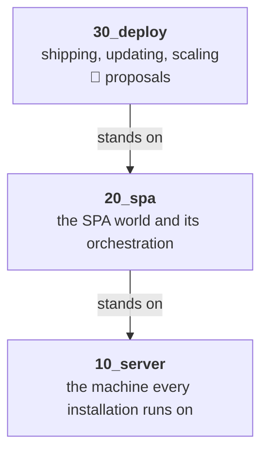
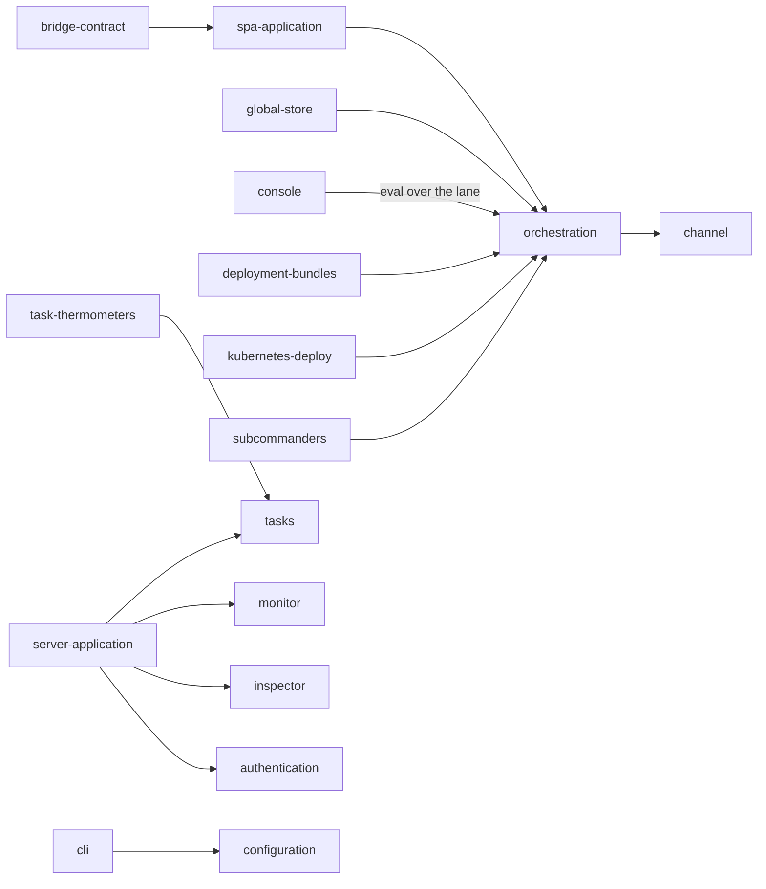

# 00 Overview — how to read this folder

**Version**: 0.6 · **Last Updated**: 2026-09-08 · **Status**: 🔴 DA REVISIONARE

kajenn as three worlds, read in order: **10_server** (the machine and
everything an installation runs on), **20_spa** (the SPA world and its
orchestration), **30_deploy** (how installations ship, update and scale —
today entirely unratified proposals). Inside each world the numbered
folders ARE the reading order: no entry needs a concept that comes later.

A **feature** is a human term before a technical one: a need users or
admins have, and our idea to solve it. A few entries are **shelves**
instead — technical strata the features stand on. That editorial
classification belongs in `tech_notes.md`; subject openings explain the
subject itself.

## The documents, and the cycle they serve

An entry is not a folder of notes: it is a **cycle** that carries one subject
from the arrival we want to what is installed, and then repeats. Four roles, in
the order they are written.

| Role | File | Job |
|---|---|---|
| the synthesis | `README.md` | half a page: what the subject is, then its parts one line each |
| **1. the arrival** | `design.md` | the subject explained in full — the macro-blocks, the structure drawn in mermaid, the working recipe that closes it — written WITHOUT looking at the code |
| the decision register | `decisions.md` | every voice with its source — a ratified decision, a commit, or the owner and a date — and the open frictions at the foot |
| **2. what exists** | `status.md` | the current state, every claim proven in the code |
| **3. the next state** | `steps/step_01/design.md` | the intermediate state this step aims at, expressed as a **diff of what exists** |
| **4. how we reach it** | `steps/step_01/plan.md` | the implementation plan — this entry's part of it |
| the working trail | `tech_notes.md` | for whoever works ON the entry: what decided what, the traps, what the next step needs |

### One tense per document

`design.md` and `decisions.md` are both written **from the day the work is
finished**: present tense, describing a server that does all of this, with no
"today", no "not yet", no "currently only". A reader must be able to open
them in 2027 and find them simply true. Anything of the form "this is a
current limit", "there is no way to do X yet", "the code has N call sites"
does not belong there — it is `status.md`'s material, and putting it in the
other two is what turns a design into a changelog. The same holds for
`README.md`, which is a synthesis of `design.md` and inherits its tense.

The one exception is the friction tail of `decisions.md`, which exists precisely
to compare the arrival with the present. That is its job, and it disappears
with the frictions.

**Two different tenses, and only one of them is banned.** What may not appear is
the tense of the IMPLEMENTATION — "not yet", "currently only", "this is a
limit". What is welcome is the tense of the READING: *"here is an example of a
configuration; the next chapter explains it in detail"*. The first says
something about the state of the code and belongs to `status.md`; the second
says nothing about the code at all, and simply tells a reader where the longer
answer lives. Use it freely, and especially where a page has to show something
whose vocabulary is owned by a later entry.

`design.md` and `status.md` deliberately separate what we WANT from what
EXISTS: mixing the two is how documents rot. A claim in `status.md` must be
verifiable in the code — `file:line` or the name of the test that proves it.
A claim in `design.md` needs no code at all, and must not be trimmed to fit
the code: its **source** — a ratified decision, a commit, or the owner and a
date — is recorded in `decisions.md`, one voice per claim.

### Who each document is written for

`README.md`, `design.md` and `status.md` are written for someone who wants to
know **the subject** — not for someone curating the dossier. So they carry no
editorial apparatus: no "this entry", no reading-order notes, no
shelf-or-feature label, no cross-reference by block number, nothing about how
the documents themselves work. A reader who opens one page in isolation must
find it complete and never once be told about the folder it lives in.

All of that is real and needed — by us. It lives in **`tech_notes.md`**, the
entry's working trail: the editorial classification, which entries lean on
this one, which register or commit decided what, the things that are easy to
search for and not find, and what whoever writes the next step must know
first. It is the one document addressed to the people building, and the only
one where the dossier may talk about itself.

References to other entries still belong in the three reader-facing
documents — but as a **pointer at the end of a block**, never woven through a
sentence. The description has to stand on its own first.

### The design principle every entry inherits

**Static only where dynamic cannot be had** (D32, SPECIFICATION.md). Staticity
is never a goal: it is accepted where dynamic has not been managed, and where
it is accepted the reason is written where the limit is accepted. No design
voice celebrates a fixed set or a restart-to-change behaviour as a virtue.

### The style contract

Four rules govern how every document in this dossier is written. They apply to
`README.md`, `design.md`, `decisions.md` and `status.md` alike.

**1. Rule first, justification after.** Every section opens with the norm, in at
most two declarative sentences. The why follows separately, after the norm has
been stated. A reader who stops at the first two sentences must still have the
rule; one who needs the reasoning reads on.

**2. Headings are searchable noun phrases carrying the official name of the
thing.** "Middleware order: one integer per layer, lowest outermost" is a
heading; "Everything in its place" is not. A heading is an index entry: it is
what somebody scans a table of contents for, and what a search matches.

**3. Only vocabulary that exists in `src/` or in the ratified registers.** A term
that names a class, a method, a configuration word or a decision uses the name
the code or the register uses. A new term is the owner's baptism and never the
document's coinage: a document that invents a word creates a name nobody can
grep and nobody else will use.

**4. One fact per sentence.** No opening scenes, no personification, no
metaphors. Short sentences, each carrying one thing, are what makes a page
reviewable: a sentence carrying three claims cannot be contradicted precisely.

### The blind verification probe

A finished entry is verified by a reader who has ONLY the documents — no code, no
transcript, no memory of the discussion. The probe is run twice; the second pass
yields as much as the first. Beyond checking the facts, it applies three tests on
the text itself.

- **The extraction test.** For every section the probe states the rule in at most
  two lines. A section it cannot extract a rule from, or extracts the wrong rule
  from, fails.
- **The search test.** The probe is given the questions a typical implementer
  arrives with, and must answer them from the headings alone. A question whose
  answer is in the text but unreachable from the table of contents fails the
  heading, not the reader.
- **The vocabulary test.** Every technical term is grepped in `src/`. A term with
  no hit and no ratified register behind it is reported as a finding.

### The frictions live at the foot of `decisions.md`

There is no frictions file. A friction is **scaffolding, not a register**: it
exists to produce a question for the interview, and it dies there.

- The audit writes the open frictions as the closing section of `decisions.md`,
  next to the register of the decisions they block.
- The interview settles them one at a time, and each answer **deletes or
  shortens** a voice: the section visibly shrinks as the conversation goes.
- Where a friction was born of a contradiction in a source — the
  specification, a decision register, a docstring — settling it **corrects
  that source too**. The correction is part of the answer, not a follow-up.
- When the section is empty, `decisions.md` can be ratified 🟢.

### Every entry closes with a working configuration

The mechanism of configuration — the tree, its layers, the read stack, the
subscribers and their triggers — is explained once, in
[015 configuration](../10_server/015_configuration/README.md). Every other entry
declares only **what it adds** to that tree, and does it by ending its
`design.md` with a **complete recipe that includes its own feature**: not a
fragment of the section it owns, but a whole installation someone could run,
with its feature in place.

A fragment cannot be checked; a whole recipe can. Which is the point: these are
**executable examples, and they are executed, never proof-read** — the same
rule that caught two broken examples in the published guides.

The complete, currently executable recipes use this format:

- one recipe per entry, the LAST section of its `design.md`, under the heading
  `## A configuration that includes it`;
- a single fenced `python` block, self-contained — imports included, one
  `AsgiConfigBuilder` subclass (including the shipped `BaseConfiguration`), nothing referenced that the block does not
  define or import;
- it must build: `AsgiServer(config=<that class>)` constructs without raising.

`tests/test_documentation_recipes.py` collects every complete recipe under that
heading and constructs its server in a separate process. Each process has a
private configuration home, temporary directory and a 20-second timeout. Run
`python -m pytest tests/test_documentation_recipes.py -o addopts=''` from the
repository root after installing `.[test]`. This proves construction, not
lifespan startup or HTTP responses. Five complete recipes exist at the
2026-09-08 baseline; entries without one still owe their recipe.

Design fragments requiring future APIs must be labelled as proposals. They do
not become executable examples merely because the intended design uses present
tense. Keep those fragments outside the complete-recipe section until their
APIs exist; record the missing recipe in the coverage matrix.

**Settled, 2026-08-24:** the **essentials of routing** have a home. A path's
resolution can be filtered on three independent axes, one per bundled plugin of
genro-routes — `auth` on the caller's **tags**, `env` on the installation's
**capabilities**, `channel` on the **channel** a request arrived through — and
the dossier described only the first. The subject now lives in
[025 routing system](../10_server/025_routing-system/README.md), which was `025_plugins`
and was renamed for it: the routing system first, the plugins after. It comes
*after* applications on purpose —
[020 applications](../10_server/020_applications/README.md) states that an application
**is** a routing class, and that one sentence is enough for its own blocks to
stand while the mechanism is explained here. *(Owner, 2026-08-24.)*

### `design.md` and `decisions.md` are the fixed pole

Once `decisions.md` is ratified 🟢, **the design does not move** — neither the
register nor the `design.md` it accounts for. `status.md` changes with every
delivery, step folders accumulate, the code turns over — and the design stays
exactly where it was. That is what makes it usable as a target: a destination
that drifts is not a destination.

Three things follow.

- **Implementation never edits the design.** A phase that finds itself
  amending `design.md` while building is a phase that has gone wrong: what a
  step aims at belongs to `steps/step_0n/design.md`, and what it achieved
  belongs to `status.md`. If delivering a step really does force a design
  edit, either the step was wrong or the design was — and that is a
  conversation, not a commit.
- **Changing it is changing the destination.** It happens when we change our
  minds about where we are going: an event, deliberate and visible, carrying a
  version bump, a date, and a note of what moved and why — because other
  entries lean on it.
- **The body moves once, before ratification.** Settling a friction can
  rewrite a section; that is the interview doing its job. After 🟢, stillness.

The contrast with `status.md` is the whole point: the status is updated in the
SAME change that alters the behaviour, so it is coupled to every commit; the
design is coupled to none.

### The steps live in their own folders

Four documents stay at the top of an entry, always — `README.md`, `design.md`,
`decisions.md`, `status.md`. They are what you open to understand the subject,
and their number never grows.

Everything a step needs lives under `steps/`, one folder per step, numbered
and incrementing:

```
010_server/
    README.md        half a page: the subject, and its parts
    design.md        the arrival, explained in full
    decisions.md     the decision register, with the open frictions at the foot
    status.md        what exists today
    steps/
        step_01/
            design.md    the state this step aims at — a diff of status.md
            plan.md      how this entry gets there
        step_02/
            ...
```

An intermediate state is not a different kind of document: it is the same
**design**, at a waypoint — which is why it keeps the name at its own level.
The series converges: every `steps/step_0n/design.md` is a state we would be
content to run in production, each closer to the entry's `design.md` than the
last, and each written as the diff from the `status.md` in force when it was
drafted.

**Delivered steps stay.** When a step is done its state becomes the present
and `status.md` moves; the step folder remains as the road travelled. It costs
nothing, because it never crowded the reading surface to begin with.

**Numbering is per entry.** Entry A may be at its step 3 while entry B is at
its step 1, so step numbers never match across entries — even for one
transversal plan. A step that belongs to a transversal plan names it inside
its own folder; the number alone never carries that link.

### The order of the cycle, and what gates what

1. **Audit.** Writes `README.md`, role 1, the register (🔴, with its friction
   tail) and role 2, and the interview file in `temp/interview_<entry>.md`.
   Nothing is ratified here.
2. **Interview.** Settles the frictions, corrects the upstream sources, and
   takes `decisions.md` to 🟢.
3. **The next step.** `steps/step_0n/design.md` is a diff toward a target, so
   it cannot be written before the entry's `decisions.md` is ratified.
4. **The plan.** `steps/step_0n/plan.md` follows the step it implements.

Then it repeats: delivering `step_0n` makes `status.md` move, and `step_0n+1`
is written against the new distance from `design.md`.

### The generation ends when the two documents meet

The distance between `design.md` and `status.md` IS the work remaining, entry
by entry. Steps close that distance. When an entry's status has reached its
design, that entry is done; when every entry has, the **generation** is done —
the two documents now say the same thing, one in the voice of the destination
and one with a `file:line` behind every claim.

That is what makes a motionless design livable: it does not stand still
forever, it stands still **for one generation**.

**A new generation duplicates the whole dossier.** The next release is not an
amendment of these documents: `internals/` is copied whole, the designs in the
copy are rewritten toward the new destination, and the designs just reached
become the starting situation the new ones are measured against. Nothing is
thrown away — an arrival becomes a baseline.

`internals/` always names the LIVE generation, and a finished one is archived
under a dated name. Never the other way round: every link and every habit
points at `internals/`, and it is the archive that is opened rarely.

### A plan may be transversal; its local part stays home

One step often touches several entries at once and needs them adapted
together. So a plan can be transversal — but **each entry keeps its own part
of it in its own step folder**, which names the transversal plan it serves.

The **coordinator** puts the sub-plans together, checks that they are
harmonious and coherent, and only then launches a workflow. It is the one
role that reads across entries: everything else in this dossier is written
from inside a single one. The assembly point today is `.phased/roadmap.md`.

## The rules

- **Static is never a goal.** Where a design says something is fixed at boot,
  fixed at construction, or changeable only by restart, it says WHY it could
  not be made dynamic. Immobility is a limit we have not yet removed, never a
  property to celebrate. *(Owner, 2026-08-23; ratified as D32 on 2026-08-25.)*
- **A feature lives where it is born.** Restart is born in the server world;
  what the SPA, the subcommanders or Kubernetes add to it are sections of
  its own documents — never twin folders.
- **Contribution contract, not name-knowledge.** A server-level surface
  (monitor, inspector) grows by CALLING each application for its panel —
  the `app_snapshot`/`app_panel`/`panel_source` style — never by knowing an
  application by name.
- **Anticipate a reason; never rebuild a mechanism.** When something that
  comes later is the *motive* for a choice made here, say so and say enough of
  it to make the choice make sense — a design whose reasons live elsewhere
  reads as arbitrary, and arbitrary is unreviewable. What stays off-limits is
  the later subject's *machinery*: explain why the identity of an application
  must be stable, not how the command that changes the installed set works.
  The test is whether the page still reads as complete to someone who stops
  here. *(Owner, 2026-08-23, amending the earlier "forward references only as
  pointers", which made choices look unmotivated.)*
- **Diagrams**: mermaid inside the doc they illustrate; a standalone SVG
  only when mermaid cannot express it. Every named box must exist in the
  code — a diagram with an invented name is worse than no diagram.
- A friction living BETWEEN two entries is recorded in both, same wording,
  and settled once for both.

## The whole building at a glance

Three worlds, each standing on the one below. What lives inside each is the
three tables that follow — a diagram of those lists would only redraw them.



## 10_server — the machine, in reading order

| Entry | In one line |
|---|---|
| [010 server](../10_server/010_server/README.md) | the ground: the server object, the applications it hosts, how a request finds one, ordered start and stop |
| [015 configuration](../10_server/015_configuration/README.md) | the tree every entry reads its own words from: layers, read stack, subscribers |
| [020 applications](../10_server/020_applications/README.md) | RoutedApplication and the routing tree · [openapi](../10_server/020_applications/openapi/README.md) · [mcp](../10_server/020_applications/mcp/README.md) |
| [025 routing system](../10_server/025_routing-system/README.md) | what a routing class is: the tree, the filtered walk, and the plugins armed on it |
| [030 middleware](../10_server/030_middleware/README.md) | the uniform middleware chain every request passes |
| [040 sessions](../10_server/040_sessions/README.md) | per-user server-side state between requests |
| [050 authentication](../10_server/050_authentication/README.md) | 401 vs 403 · [avatar](../10_server/050_authentication/avatar/README.md) · [tags](../10_server/050_authentication/tags/README.md) |
| [055 websocket](../10_server/055_websocket/README.md) | WSX requests and events, handshake identity, page channels, and the raw WebSocket seam |
| [060 storage](../10_server/060_storage/README.md) | the only access to the filesystem, through storage nodes |
| [065 db](../10_server/065_db/README.md) | databases mounted through the recipe, no backend in the core |
| [070 tasks](../10_server/070_tasks/README.md) | work that is no HTTP request |
| [080 task-thermometers](../10_server/080_task-thermometers/README.md) | see a batch move, stop it politely |
| [090 server-application](../10_server/090_server-application/README.md) | the `_server` app and its sections · [monitor](../10_server/090_server-application/monitor/README.md) · [inspector](../10_server/090_server-application/inspector/README.md) |
| [110 cli](../10_server/110_cli/README.md) | drive installations from the shell |
| [120 restart](../10_server/120_restart/README.md) | born here; enriched by spa → subcommanders → kube |

## 20_spa — the SPA world

| Entry | In one line |
|---|---|
| [010 spa-application](../20_spa/010_spa-application/README.md) | a stable, stateless front to the hosted site |
| [020 orchestration](../20_spa/020_orchestration/README.md) | many users with live state, scaled across processes, never split |
| [030 channel](../20_spa/030_channel/README.md) | the wire: frames, hub, the lane (shelf) |
| [040 global-store](../20_spa/040_global-store/README.md) | one shared state, safe read-modify-write |
| [070 console](../20_spa/070_console/README.md) | ask a live pool the questions nobody predicted |
| [080 bridge-contract](../20_spa/080_bridge-contract/README.md) | what genropy-asgi implements and consumes — generalized core, legacy logic in the bridge |

## 30_deploy — shipping, updating, scaling (🔴 proposals)

| Entry | In one line |
|---|---|
| [010 deployment-bundles](../30_deploy/010_deployment-bundles/README.md) | immutable bundles on S3, channels, cohorts, promotion without rebuild |
| [020 kubernetes-deploy](../30_deploy/020_kubernetes-deploy/README.md) | the cluster runs, the commander decides |
| [030 subcommanders](../30_deploy/030_subcommanders/README.md) | delegated authority: root → subcommander → group → worker |

## How the verticals stand on each other



## Vocabulary in historical records

Older records use several informal words alongside the public names. They do
not name additional classes or architectural layers.

| Historical word | Name to search |
|---|---|
| vertex | `SpaCommander`, the coordinator of the multiworker application |
| photo | `WorkerHandler.worker_snapshot`, the last worker observation carried by an envelope |
| lane | the channel carrying CALL/REPLY frames between worker and front |
| turn | `GlobalStoreLease`, holding the commander's store lock until release |
| motor | `WsxConnection`, owning the WSX connection protocol |

These mappings follow the existing source docstrings and decision registers.
They are reading aids, not new API names. The bridge's delivery machinery is
described in its own contract; it is not part of the generic core.
