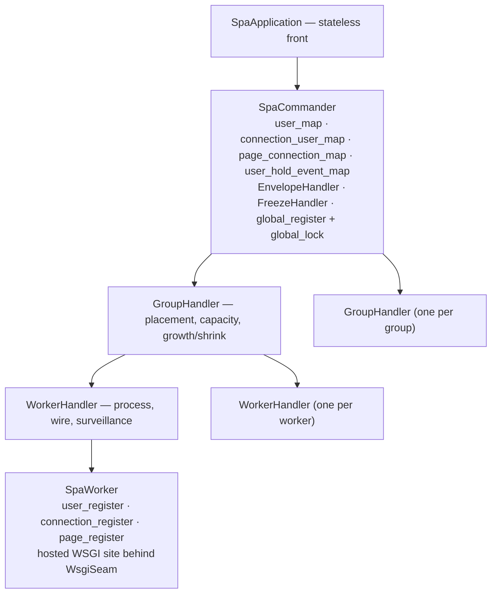
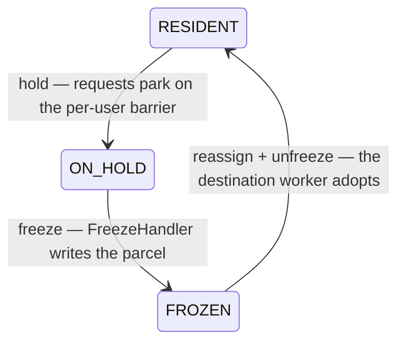

# Orchestration

**Version**: 0.1 · **Last Updated**: 2026-08-22 · **Status**: 🔴 DA REVISIONARE

**The need.** Many users with LIVE server-side state must scale across processes without a user ever splitting: all his pages live in the process that holds his store.

The pool machine: `SpaCommander` (global indexes, lifecycle, per-user
barrier, request chain, single-writer fold via `EnvelopeHandler`, freezer
via `FreezeHandler`) → n `GroupHandler` (placement,
capacity, growth and shrink) → n `WorkerHandler` (process, wire,
surveillance) → `SpaWorker` (live users/connections/pages and the hosted
WSGI site behind `WsgiSeam`). Usersticky principle: ALL pages of one user
live in the process that holds the user's store. Mobility has ONE path:
hold → freeze → reassign → unfreeze. A sudden worker death restarts the
few users involved — an accepted, observable risk.

Interactions: spa-application (above) · channel (below) · global-store (it carries it) · storage (freezer) · restart.

## The chain and its registers

Every index above the worker is written ONLY by the single-writer fold of the
envelope chain: the worker announces, the parent applies.

## Mobility — the one path

Used for compaction, ordered replacement and wake. There is no direct
worker-to-worker move. A sudden worker death skips the path entirely: the
users involved restart.
