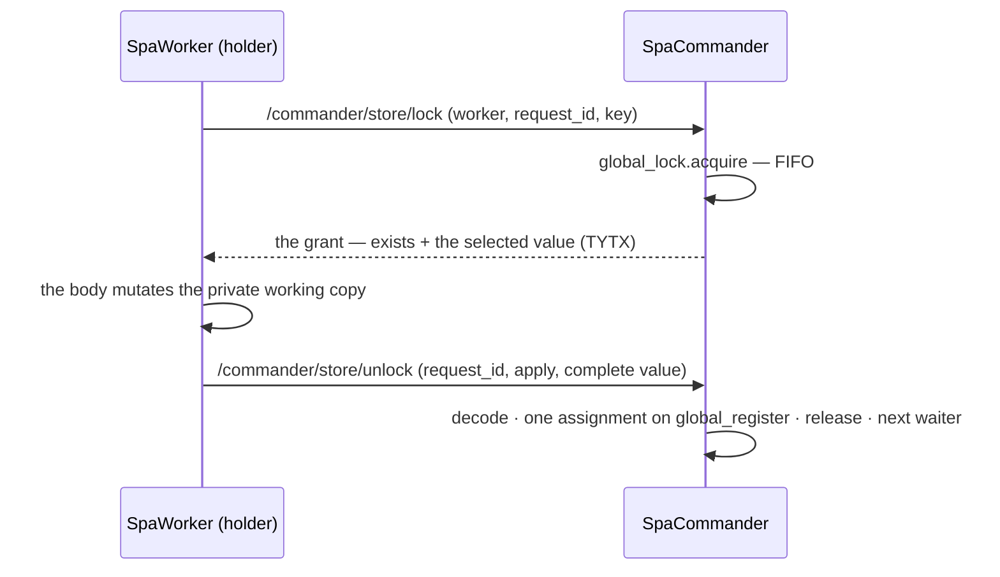

# Global store

**Version**: 0.3 · **Last Updated**: 2026-09-08 · **Status**: 🔴 DA REVISIONARE

**The need.** The hosted application needs one state shared across every user and page, with a safe read-modify-write — no torn writes, no stale copies.

One `dict[str, Any]` living ONLY on the commander — no replicas, no read cache.
Keys are literal strings: a dot in a key is a character, never a path. Values are
opaque — a scalar, a dict, a Bag of either kind, anything the TYTX codec encodes.
The commander never looks inside a value. Every access a worker makes is a CALL on
the lane. Never files or shared memory between processes.

Interactions: orchestration (the lane, the lock).

## One lock, and every operation waits on it

`GlobalStoreLock` is an `asyncio.Lock` — FIFO by construction — plus the holder of
the turn: `holder` (request id), `holder_worker`, `holder_key`. `get`, `set` and
`del` take that lock for the length of their own operation and record no holder. A
turn holds it from `lock` to `unlock`. While a turn is in force every other
operation waits, reads of other keys included. Selecting a key limits what
travels, not what the lock covers.

The five operations are `GlobalStoreOperations` on the commander's dispatcher,
routed at `/commander/store/{get,set,del,lock,unlock}`. A non-string key is
refused with `TypeError` on all of them; `key=None` on `lock` means the whole
dictionary and nothing else.

`get` answers `exists` beside `value`. The client returns the caller's `default`
only when `exists` is false, and the stored value — `None` included — otherwise.
The default never travels to the commander.

## GlobalStoreLease read-modify-write

Worker-handler fragment: `worker` is the live `SpaWorker`; this is not a
standalone configuration recipe. Run it from a pool thread, or use `async with`
inside an async handler.

```python
store = worker.global_store              # GlobalStoreClient

with store.for_update("CACHE_TS") as turn:
    if not turn.exists:
        turn.value = {}
    turn.value["foo"] = 1
```

`for_update(key=None)` answers a `GlobalStoreLease`, usable with `with` from a
pool thread or `async with` on the loop. It yields ITSELF: `value` is the private
working copy the grant decoded, `exists` says whether the key was there at grant
time. Assigning `value` or mutating it reaches nothing until the exit.

A successful exit sends the COMPLETE value with `apply=True`; the commander
replaces the selected key in one assignment — or the whole dictionary, with
`clear()` + `update()`, for a turn with no key. `key=None` starts the turn on a
snapshot of the whole dictionary and its published value must be a `dict`, refused
with `TypeError` otherwise.

Four cases release with `apply=False` and leave the master exactly as the grant
found it: a body that raises, a grant that does not decode, a value that does not
encode, and a turn on which `abort()` was called. `abort()` marks the turn; the
lock stays held until the block exits, and nothing the body does to `value`
afterwards is published.

The client keeps a `ContextVar` set while a lease is in force. A second
`for_update`, or a simple operation, from the same task or pool thread raises
`RuntimeError` at once instead of parking on the lock that context already holds.
Other threads of the same worker wait normally.



## Worker failure and GlobalStoreCommitUnconfirmed

A release quoting a request id that is not the holder's publishes nothing and
frees nothing: it answers `{"applied": False}`. It must never free a newer turn.

A worker whose wire ends gives its grant back:
`WorkerHandler.on_child_lost` calls `GlobalStoreOperations.release_worker_lock`,
which releases only when that worker is the holder and applies nothing — the
changes lived on its own working copy, which died with it. Its queued
acquisitions are cancelled by the connector's `_cancel_child_calls` over
`_service_tasks`. No lease timer and no expiry: the channel EOF is the whole
death protocol.

A commit whose answer never came raises `GlobalStoreCommitUnconfirmed(request_id,
key, cause)`: the commit CALL left, the wire failed before the REPLY, and the
commander MAY already have published the value. Nothing is retried and no abort
is attempted on a wire that is gone — a worker whose wire ends fails every parked
CALL with `ConnectionError`, which is the only exception the lease wraps. A
commander that REFUSED the commit is not this case and propagates as it is.

`global_store.py` imports nothing from `orchestration`: the module is importable
on its own.

## Accepted limitations

- A stored string that looks like TYTX typed text (`"42::L"`) collides with the
  codec. No escaping is built; owner decision.
- Datetime handling at the legacy boundary belongs to genropy-asgi, not to the
  core.
